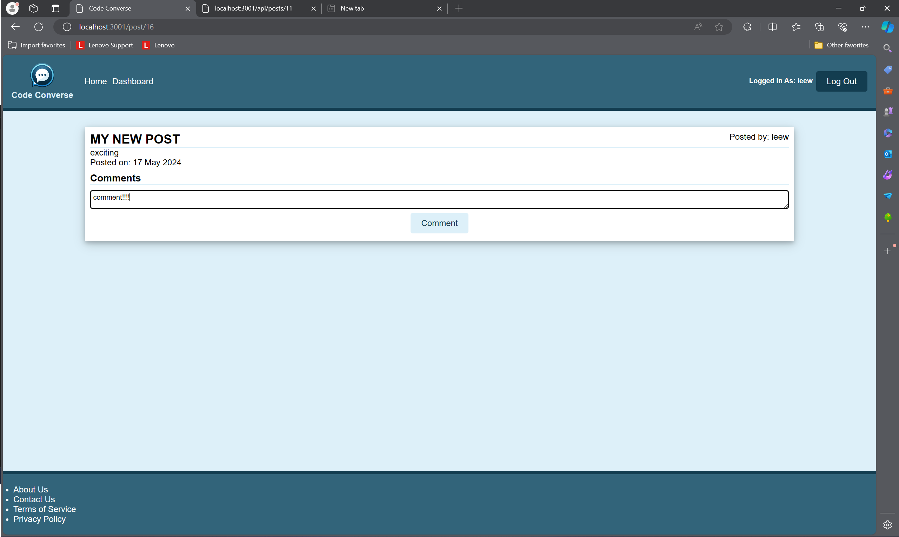
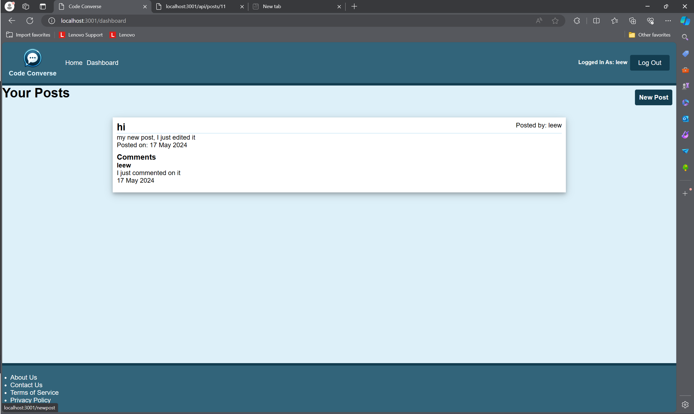
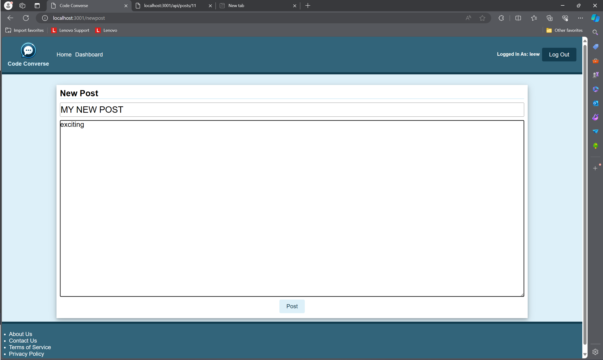
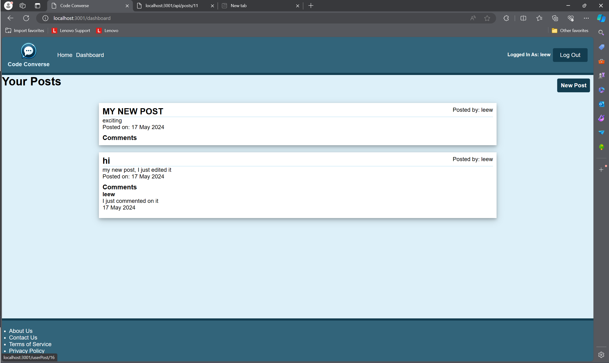
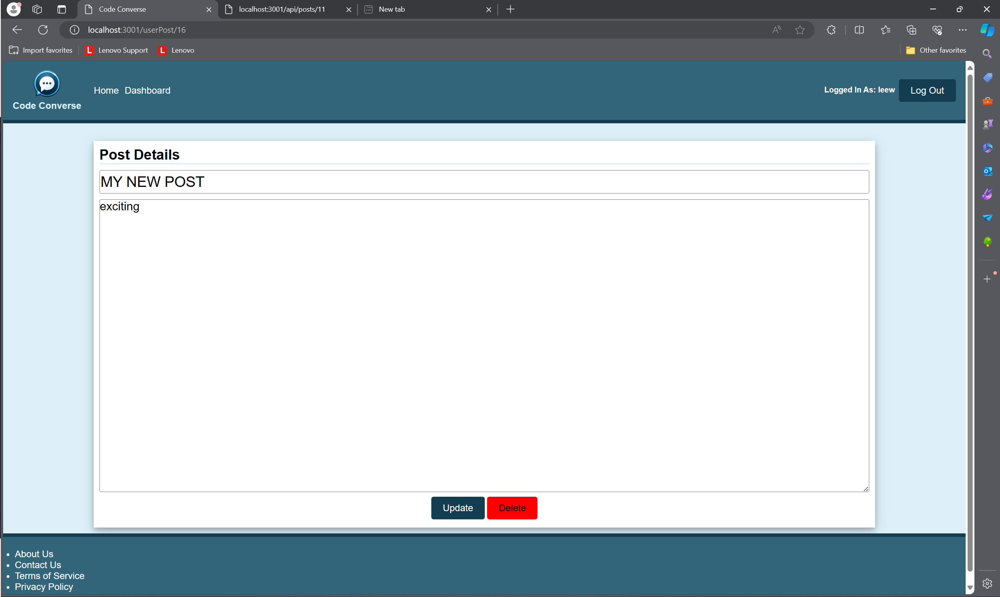

# CodeConverse

## Description
Introducing CodeConverse, my personal blog post project built as a place for users to post and comment on all things 0 and 1!!!

CodeConverse was a project that tested me on everything I have learnt up until now. I went back to basics with html and css, brushed up on my front end js with event listeners and fetch requests. And continued to expand upon my knowledge of sessions, routes/controllers, models and learnt alot about forms and how I can handle GET and POST requests server side instead of client side.

This project gave me the most bugs I have had in any (hairs were lost). My most frustrating came from the comment section and trying to get the user's name to show up. In the end it turns out I hadn't been defining the session id as the user id for my post route for the comments. As frustrating as these bugs were, I am grateful that I went through what I did as it definitely made me a better developer (I will never forget to define an id again)

## Installation
Visit the link here to view my website: [https://beefy-stock.onrender.com/](https://codeconverse.onrender.com/)

Sometimes the link may not work as I use the database for another project. In this case the repo is able to be cloned and a postgres database created. You can find the commands for seeding the database and running the server within the package.json file

## Usage
Once you have the website open simply create an account and you will be greeted with 3 posts. To view more you will have to sign up. Upon signing up you will have the option to comment on posts...

view your dashboard...

Create a new post from your dash...

and from your dash you can click a post's header and delete that post

## Credits
n/a

## License
n/a

## Contributing
n/a

## Tests
n/a

## Questions
for any questions you can reach me at: leewheeler123@gmail.com 

or visit my github profile: github.com/LWSE13
